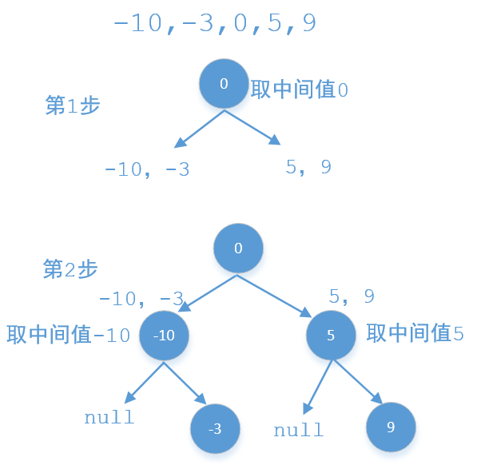
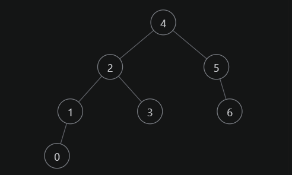

### 1. 最小二叉搜索树

给定一个有序整数数组，元素各不相同且按升序排列，编写一个算法，创建一棵高度最小的二叉搜索树。

1. 示例

   给定有序数组: [-10,-3,0,5,9],

   一个可能的答案是：[0,-3,9,-10,null,5]，它可以表示下面这个高度平衡二叉搜索树：

   ```
        0 
       / \ 
     -3   9 
     /   / 
   -10  5 
   ```

   

#### 解法：递归

题中说了要转换为一棵高度平衡的二叉搜索树，并且数组又是排过序的，这就好办了，我们可以使用递归的方式，每次取数组中间的值比如m作为当前节点，m前面的值作为他左子树的结点值，m后面的值作为他右子树的节点值，示例中一个可能的结果是：



代码如下：

```java
public utils.TreeNode sortedArrayToBST(int[] nums) {
    return ArrayToBST(nums, 0, nums.length - 1);
}

public utils.TreeNode ArrayToBST(int[] nums, int start, int end) {
    if (start > end) {
        return null;
    }
    int mid = start + (end-start)/2;
    utils.TreeNode root = new utils.TreeNode(nums[mid]);
    root.left = ArrayToBST(nums, start, mid-1);
    root.right = ArrayToBST(nums, mid+1, end);
    return root;
}

```

---


### 2. 二叉搜索树转换单链表

二叉树数据结构 utils.TreeNode 可用来表示单向链表（其中 left 置空，right 为下一个链表节点）。实现一个方法，把二叉搜索树转换为单向链表，要求依然符合二叉搜索树的性质，转换操作应是原址的，也就是在原始的二叉搜索树上直接修改。

返回转换后的单向链表的头节点。

1. 示例

   输入： [4,2,5,1,3,null,6,0]

   输出： [0,null,1,null,2,null,3,null,4,null,5,null,6]


#### 解法：逆中序遍历

1. 二叉搜索树通过中序遍历，可以得到升序的结果。那么在进行中序遍历的时候，记录一下前一个结点，然后让前一个节点的右指针指向当前节点，即可按升序连成链表。
   可以采用递归方式遍历，并使用成员变量记录前一个结点。
2. 注意到，如果按照一般的中序遍历（左，根，右），遍历结束后，确实形成了一个链表，但最终记录的结点是最右边的节点，即链表尾结点，而题目要求返回头结点。所以，我们可以从尾部到头部连接链表，即逆中序遍历（右，根，左），遍历过程中连接节点，遍历结束后，记录的是最左的结点，该节点即为链表头结点。
3. 注意要置空左指针，并且要在遍历完左子树之后再置空。

举例：



如示例中，逆中序的遍历顺序为：6,5,4,3,2,1,0，当遍历到结点2时，6,5,4,3已经遍历过，此时记录的结点为3，修改当前结点2的右指针，使其指向结点3，并修改记录的结点minNode为结点2，接着遍历结点2的左子树。

```java
import utils.TreeNode;

class leetcode.Solution {

   TreeNode minNode;

   public TreeNode convertBiNode (TreeNode root) {
      reverseInorder(root);
      return minNode;
   }

   private void reverseInorder (TreeNode root) {
      if (root == null) {
         return;
      }
      // 遍历右子树
      reverseInorder(root.right);
      // 遍历根节点，根节点是右子树的前驱节点
      root.right = minNode;
      minNode = root;
      //遍历左子树
      reverseInorder(root.left);
      //置空左指针
      root.left = null;
   }
}

```

---


### 3. 二叉搜索树的最近公共祖先

给定一个二叉搜索树, 找到该树中两个指定节点的最近公共祖先。

最近公共祖先的定义为：“对于有根树 T 的两个结点 p、q，最近公共祖先表示为一个结点 x，满足 x 是 p、q 的祖先且 x 的深度尽可能大（一个节点也可以是它自己的祖先）。

1. 示例 1

   输入: root = [6,2,8,0,4,7,9,null,null,3,5], p = 2, q = 8

   输出: 6 

   解释: 节点 2 和节点 8 的最近公共祖先是 6。


#### 解法：遍历

注意到题目中给出的是一棵「二叉搜索树」，因此我们可以快速地找出树中的某个节点以及从根节点到该节点的路径，例如我们需要找到节点 p：

1. 我们从根节点开始遍历；
2. 如果当前节点就是 p，那么成功地找到了节点；
3. 如果当前节点的值大于 p 的值，说明 p 应该在当前节点的左子树，因此将当前节点移动到它的左子节点；
4. 如果当前节点的值小于 p 的值，说明 p 应该在当前节点的右子树，因此将当前节点移动到它的右子节点。

为此，遍历二叉搜索树找到最近公共祖先的算法如下：

1. 我们从根节点开始遍历；
2. 如果当前节点的值大于 p 和 q 的值，说明 p 和 q 应该在当前节点的左子树，因此将当前节点移动到它的左子节点；
3. 如果当前节点的值小于 p 和 q 的值，说明 p 和 q 应该在当前节点的右子树，因此将当前节点移动到它的右子节点；
4. 如果当前节点的值不满足上述两条要求，那么说明当前节点就是「分岔点」。此时，p 和 q 要么在当前节点的不同的子树中，要么其中一个就是当前节点。

```java
/**
 * 采用递归的方式进行求解
 */
public TreeNode lowestCommonAncestor(TreeNode root, TreeNode p, TreeNode q) {
    if (p.val < root.val && q.val < root.val) {
        return lowestCommonAncestor(root.left, p, q);
    } else if (p.val > root.val && q.val > root.val) {
        return lowestCommonAncestor(root.right, p, q);
    } else {
        return root;
    }
}

/**
 * 采用非递归的方式进行求解
 */
public TreeNode lowestCommonAncestor(TreeNode root, TreeNode p, TreeNode q) {
    TreeNode ancestor = root;
    while (true) {
        if (p.val < ancestor.val && q.val < ancestor.val) {
            ancestor = ancestor.left;
        } else if (p.val > ancestor.val && q.val > ancestor.val) {
            ancestor = ancestor.right;
        } else {
            break;
        }
    }
    return ancestor;
}

```

---


### 4. 二叉搜索树中的众数

给你一个含重复值的二叉搜索树（BST）的根节点 root ，找出并返回 BST 中的所有 众数（即，出现频率最高的元素）。

如果树中有不止一个众数，可以按 任意顺序 返回。

1. 示例 1

   输入：root = [1,null,2,2]

   输出：[2]


2. 示例 2

   输入：root = [0]

   输出：[0]


#### 解法：中序遍历

首先我们一定能想到一个最朴素的做法：因为这棵树的中序遍历是一个有序的序列，所以我们可以先获得这棵树的中序遍历，然后从扫描这个中序遍历序列，然后用一个哈希表来统计每个数字出现的个数，这样就可以找到出现次数最多的数字。但是这样做的空间复杂度显然不是 $O(1)$ 的，原因是哈希表和保存中序遍历序列的空间代价都是 $O(n)$。

首先，我们考虑在寻找出现次数最多的数时，不使用哈希表。 这个优化是基于二叉搜索树中序遍历的性质：一棵二叉搜索树的中序遍历序列是一个非递减的有序序列。例如：


          1
        /   \
       0     2
      / \    /
    -1   0  2

这样一颗二叉搜索树的中序遍历序列是 $\{−1,0,0,1,2,2\}$。我们可以发现重复出现的数字一定是一个连续出现的，例如这里的 $0$ 和 $2$，它们都重复出现了，并且所有的 $0$ 都集中在一个连续的段内，所有的 $2$ 也集中在一个连续的段内。我们可以顺序扫描中序遍历序列，用 $\textit{base}$ 记录当前的数字，用 $\textit{count}$ 记录当前数字重复的次数，用 $maxCount$ 来维护已经扫描过的数当中出现最多的那个数字的出现次数，用 $answer$ 数组记录出现的众数。每次扫描到一个新的元素：

1. 首先更新 $base$ 和 $count$:
   - 如果该元素和 $base$ 相等，那么 $count$ 自增 $1$；
   - 否则将 $base$ 更新为当前数字，$count$ 复位为 1。

2. 然后更新 $maxCount$：
   - 如果 $count=maxCount$，说明当前数字为众数，将 $base$ 加入 $answer$ 数组；
   - 如果 $count>maxCount$，那么说明当前的这个数字（$base$）出现的次数大于当前众数出现的次数，因此，我们需要将 $maxCount$ 更新为 $count$，清空 $answer$ 数组后将 $base$ 加入 $answer$ 数组。

我们可以把这个过程写成一个 $update$ 函数。这样我们在寻找出现次数最多的数字的时候就可以省去一个哈希表带来的空间消耗。

然后，我们考虑不存储这个中序遍历序列。 如果我们在递归进行中序遍历的过程中，访问当了某个点的时候直接使用上面的 $update$ 函数，就可以省去中序遍历序列的空间，代码如下。

```java
List<Integer> answer = new ArrayList<Integer>();
int base, count, maxCount;

public int[] findMode(TreeNode root) {
    dfs(root);
    int[] mode = new int[answer.size()];
    for (int i = 0; i < answer.size(); ++i) {
        mode[i] = answer.get(i);
    }
    return mode;
}

public void dfs(TreeNode o) {
    if (o == null) {
        return;
    }
    dfs(o.left);
    update(o.val);
    dfs(o.right);
}

public void update(int x) {
    if (x == base) {
        ++count;
    } else {
        count = 1;
        base = x;
    }
    if (count == maxCount) {
        answer.add(base);
    }
    if (count > maxCount) {
        maxCount = count;
        answer.clear();
        answer.add(base);
    }
}

```

---


### 5. 二叉搜索树的最小绝对差

给你一个二叉搜索树的根节点`root` ，返回 **树中任意两不同节点值之间的最小差值**。

差值是一个正数，其数值等于两值之差的绝对值。

1. 示例 1

   输入：root = [4,2,6,1,3]

   输出：1


2. 示例 2

   输入：root = [1,0,48,null,null,12,49]

   输出：1


#### 解法：中序遍历

考虑对升序数组 aa 求任意两个元素之差的绝对值的最小值，答案一定为相邻两个元素之差的最小值，即

$$
\textit{ans}=\min_{i=0}^{n-2}\left\{a[i+1]-a[i]\right\}
$$
其中 $n$ 为数组 $a$ 的长度。其他任意间隔距离大于等于 $2$ 的下标对 $(i,j)$ 的元素之差一定大于下标对 $(i,i+1)$ 的元素之差，故不需要再被考虑。

回到本题，本题要求二叉搜索树任意两节点差的绝对值的最小值，而我们知道二叉搜索树有个性质为二叉搜索树中序遍历得到的值序列是递增有序的，因此我们只要得到中序遍历后的值序列即能用上文提及的方法来解决。

朴素的方法是经过一次中序遍历将值保存在一个数组中再进行遍历求解，我们也可以在中序遍历的过程中用 $base$ 变量保存前驱节点的值，这样即能边遍历边更新答案，不再需要显式创建数组来保存，需要注意的是 $base$ 的初始值应该设置为 $Integer.MAX\_VALUE$，这样就能消除 $base$ 初值对代码设计的影响。

```java
int base = Integer.MAX_VALUE;
int min = Integer.MAX_VALUE;
public int getMinimumDifference(TreeNode root) {
    dfs(root);
    return min;
}

public void dfs(TreeNode node) {
    if (node == null) {
        return;
    }
    dfs(node.left);
    update(node.val);
    dfs(node.right);
}

public void update(int val) {
    min = Math.min(Math.abs(val-base), min);
    base = val;
}

```

---


### 6. 递增顺序搜索树

给你一棵二叉搜索树的 `root` ，请你 **按中序遍历** 将其重新排列为一棵递增顺序搜索树，使树中最左边的节点成为树的根节点，并且每个节点没有左子节点，只有一个右子节点。

1. 示例 1

   输入：root = [5,3,6,2,4,null,8,1,null,null,null,7,9]

   输出：[1,null,2,null,3,null,4,null,5,null,6,null,7,null,8,null,9]


2. 示例 2

   输入：root = [5,1,7]

   输出：[1,null,5,null,7]


#### 解法：在中序遍历的过程中改变节点指向

采用中序遍历遍历二叉搜索树，当我们遍历到一个节点时，把它的左孩子设为空，并将其本身作为上一个遍历到的节点的右孩子。这里需要有一些想象能力。递归遍历的过程中，由于递归函数的调用栈保存了节点的引用，因此上述操作可以实现。下面的幻灯片展示了这样的过程。

题解链接：[递增顺序查找树 - 递增顺序搜索树 - 力扣（LeetCode）](https://leetcode.cn/problems/increasing-order-search-tree/solution/di-zeng-shun-xu-cha-zhao-shu-by-leetcode-dfrr/)

```java
private TreeNode resNode;

public TreeNode increasingBST (TreeNode root) {
    TreeNode dummyNode = new TreeNode(-1);
    resNode = dummyNode;
    inorder(root);
    return dummyNode.right;
}

public void inorder(TreeNode node) {
    if (node == null) {
        return;
    }
    inorder(node.left);

    resNode.right = node;
    node.left = null;
    resNode = node;

    inorder(node.right);
}
```

---

