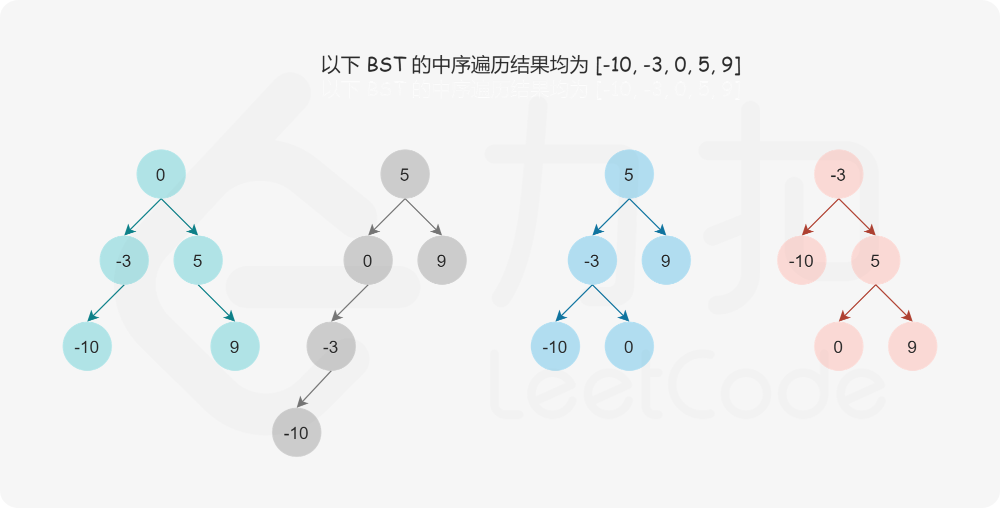

### 1. 检查平衡性

实现一个函数，检查二叉树是否平衡。在这个问题中，平衡树的定义如下：任意一个节点，其两棵子树的高度差不超过 1。

1. 示例 1

   给定二叉树 [3,9,20,null,null,15,7]

   ```
       3
      / \
     9  20
       /  \
      15   7
   ```

   返回 true 。

   

2. 示例 2：

   给定二叉树 [1,2,2,3,3,null,null,4,4]

   ```
         1
        / \
       2   2
      / \
     3   3
    / \
   4   4
   ```

   返回 false 。


#### 解法：递归遍历

这道题中的平衡二叉树的定义是：二叉树的每个节点的左右子树的高度差的绝对值不超过 1，则二叉树是平衡二叉树。根据定义，一棵二叉树是平衡二叉树，当且仅当其所有子树也都是平衡二叉树，因此可以使用递归的方式判断二叉树是不是平衡二叉树，递归的顺序可以是自顶向下或者自底向上。

##### 1. 自顶向下

定义函数 $height$，用于计算二叉树中的任意一个节点 $p$ 的高度：

$$
\texttt{height}(p) = \begin{cases} 0 & p \text{ 是空节点}\\ \max(\texttt{height}(p.left), \texttt{height}(p.right))+1 & p \text{ 是非空节点} \end{cases}
$$
有了计算节点高度的函数，即可判断二叉树是否平衡。具体做法类似于二叉树的前序遍历，即对于当前遍历到的节点，首先计算左右子树的高度，如果左右子树的高度差是否不超过 1，再分别递归地遍历左右子节点，并判断左子树和右子树是否平衡。这是一个自顶向下的递归的过程。

```java
public boolean isBalanced(TreeNode root) {
    if (root == null) {
        return true;
    } else {
        int left = maxDepth(root.left);
        int right = maxDepth(root.right);
        return Math.abs(left - right) <= 1 && isBalanced(root.left) && isBalanced(root.right);
    }
}

public int maxDepth(TreeNode root) {
    if (root == null) {
        return 0;
    } else {
        int leftHeight = maxDepth(root.left);
        int rightHeight = maxDepth(root.right);
        return Math.max(leftHeight, rightHeight) + 1;
    }
}

```


##### 2. 自底向上

方法一由于是自顶向下递归，因此对于同一个节点，函数 $\texttt{height}$ 会被重复调用，导致时间复杂度较高。如果使用自底向上的做法，则对于每个节点，函数 $\texttt{height}$ 只会被调用一次。

自底向上递归的做法类似于后序遍历，对于当前遍历到的节点，先递归地判断其左右子树是否平衡，再判断以当前节点为根的子树是否平衡。如果一棵子树是平衡的，则返回其高度（高度一定是非负整数），否则返回 $−1$。如果存在一棵子树不平衡，则整个二叉树一定不平衡。

```java
public boolean isBalanced(utils.TreeNode root) {
    return height(root) >= 0;
}

public int height(utils.TreeNode root) {
    if (root == null) {
        return 0;
    }
    int leftHeight = height(root.left);
    int rightHeight = height(root.right);
    if (leftHeight == -1 || rightHeight == -1 || Math.abs(leftHeight - rightHeight) > 1) {
        return -1;
    } else {
        return Math.max(leftHeight, rightHeight) + 1;
    }
}

```

---


### 2. 相同的树

给你两棵二叉树的根节点 p 和 q ，编写一个函数来检验这两棵树是否相同。

如果两个树在结构上相同，并且节点具有相同的值，则认为它们是相同的。

1. 示例 1

   输入：p = [1,2,3], q = [1,2,3]

   输出：true


2. 示例 2

   输入：p = [1,2], q = [1,null,2]

   输出：false


#### 解法：深度优先搜索

如果两个二叉树都为空，则两个二叉树相同。如果两个二叉树中有且只有一个为空，则两个二叉树一定不相同。

如果两个二叉树都不为空，那么首先判断它们的根节点的值是否相同，若不相同则两个二叉树一定不同，若相同，再分别判断两个二叉树的左子树是否相同以及右子树是否相同。这是一个递归的过程，因此可以使用深度优先搜索，递归地判断两个二叉树是否相同。

```java
public boolean isSameTree(TreeNode p, TreeNode q) {
    // 根节点均为空
    if (p == null && q == null) {
        return true;
    }
    // 根节点其中一个为空，另一个不为空
    else if (p == null || q == null) {
        return false;
    }
    // 根节点均不为空，且 值不同
    else if (p.val != q.val) {
        return false;
    }
    // 根节点均不为空，且 值相等
    else {
        return isSameTree(p.left, q.left) && isSameTree(p.right, q.right);
    }
}

```

---


### 3. 对称二叉树

给你一个二叉树的根节点 root ， 检查它是否轴对称。

1. 示例 1

   输入：root = [1,2,2,3,4,4,3]

   输出：true


2. 示例 2

   输入：root = [1,2,2,null,3,null,3]

   输出：false


#### 解法：深度优先搜索

如果一个树的左子树与右子树镜像对称，那么这个树是对称的。

因此，该问题可以转化为：两个树在什么情况下互为镜像？

如果同时满足下面的条件，两个树互为镜像：

1. 它们的两个根结点具有相同的值
2. 每个树的右子树都与另一个树的左子树镜像对称


我们可以实现这样一个递归函数，通过「同步移动」两个指针的方法来遍历这棵树，p 指针和 q 指针一开始都指向这棵树的根，随后 p 右移时，q 左移，p 左移时，q 右移。每次检查当前 p 和 q 节点的值是否相等，如果相等再判断左右子树是否对称。

```java
public boolean isSymmetric(TreeNode root) {
    return isSymmetric(root, root);
}

public boolean isSymmetric(TreeNode left, TreeNode right) {
    if (left == null && right == null) {
        return true;
    } else if (left == null || right == null) {
        return false;
    } else if (left.val != right.val) {
        return false;
    } else {
        return isSymmetric(left.left, right.right) && isSymmetric(left.right, right.left);
    }
}

```

---


### 4. 二叉树的最大深度

给定一个二叉树，找出其最大深度。

二叉树的深度为根节点到最远叶子节点的最长路径上的节点数。

说明: 叶子节点是指没有子节点的节点。

    示例1：给定二叉树 [3,9,20,null,null,15,7]，返回它的最大深度 3 。
        3
       / \
      9  20
        /  \
       15   7


#### 解法：深度优先搜索

如果我们知道了左子树和右子树的最大深度 $l$ 和 $r$，那么该二叉树的最大深度即为

$$
\max(l,r) + 1
$$
而左子树和右子树的最大深度又可以以同样的方式进行计算。因此我们可以用「深度优先搜索」的方法来计算二叉树的最大深度。具体而言，在计算当前二叉树的最大深度时，可以先递归计算出其左子树和右子树的最大深度，然后在 $O(1)$ 时间内计算出当前二叉树的最大深度。递归在访问到空节点时退出。

```java
public int maxDepth(TreeNode root) {
    if (root == null) {
        return 0;
    } else {
        int leftHeight = maxDepth(root.left);
        int rightHeight = maxDepth(root.right);
        return Math.max(leftHeight, rightHeight) + 1;
    }
}

```

---


### 5. 二叉树的最小深度

给定一个二叉树，找出其最小深度。最小深度是从根节点到最近叶子节点的最短路径上的节点数量。

说明：叶子节点是指没有子节点的节点。

1. 示例 1

   输入：root = [3,9,20,null,null,15,7]

   输出：2

2. 示例 2

   输入：root = [2,null,3,null,4,null,5,null,6]

   输出：5


#### 解法：深度优先搜索

首先可以想到使用深度优先搜索的方法，遍历整棵树，记录最小深度。

对于每一个非叶子节点，我们只需要分别计算其左右子树的最小叶子节点深度。这样就将一个大问题转化为了小问题，可以递归地解决该问题。

这里注意与 **二叉树最大深度** 的区别。因为必须到达叶子节点，深度才是有效的，对于一个节点，如果其左子树为空，那么，其深度应该是右子树的深度加 **1**。如果直接采用 **二叉树最大深度** 类似的对空子树的处理策略，在上述情况下，该节点的最小深度会成为 **1**，而不是右子树的深度+1。

```java
public int minDepth(TreeNode root) {
    if (root == null) {
        return 0;
    }

    if (root.left == null && root.right == null) {
        return 1;
    }

    int min_depth = Integer.MAX_VALUE;
    // 分别处理子树为空的情况
    if (root.left != null) {
        min_depth = Math.min(minDepth(root.left), min_depth);
    }
    if (root.right != null) {
        min_depth = Math.min(minDepth(root.right), min_depth);
    }

    return min_depth + 1;
}

```

---


### 6. 将有序数组转换为平衡二叉树

给你一个整数数组 nums ，其中元素已经按 升序 排列，请你将其转换为一棵 高度平衡 二叉搜索树。

高度平衡 二叉树是一棵满足「每个节点的左右两个子树的高度差的绝对值不超过 1 」的二叉树。

1. 示例 1

   输入：nums = [-10,-3,0,5,9]

   输出：[0,-3,9,-10,null,5]

   解释：[0,-10,5,null,-3,null,9] 也将被视为正确答案。

       


#### 解法

二叉搜索树的中序遍历是升序序列，题目给定的数组是按照升序排序的有序数组，因此可以确保数组是二叉搜索树的中序遍历序列。

给定二叉搜索树的中序遍历，是否可以唯一地确定二叉搜索树？答案是否定的。如果没有要求二叉搜索树的高度平衡，则任何一个数字都可以作为二叉搜索树的根节点，因此可能的二叉搜索树有多个。




如果增加一个限制条件，即要求二叉搜索树的高度平衡，是否可以唯一地确定二叉搜索树？答案仍然是否定的。


直观地看，我们可以选择中间数字作为二叉搜索树的根节点，这样分给左右子树的数字个数相同或只相差 11，可以使得树保持平衡。如果数组长度是奇数，则根节点的选择是唯一的，如果数组长度是偶数，则可以选择中间位置左边的数字作为根节点或者选择中间位置右边的数字作为根节点，选择不同的数字作为根节点则创建的平衡二叉搜索树也是不同的。


确定平衡二叉搜索树的根节点之后，其余的数字分别位于平衡二叉搜索树的左子树和右子树中，左子树和右子树分别也是平衡二叉搜索树，因此可以通过递归的方式创建平衡二叉搜索树。

在给定中序遍历序列数组的情况下，每一个子树中的数字在数组中一定是连续的，因此可以通过数组下标范围确定子树包含的数字，下标范围记为 $[\textit{left}, \textit{right}]$。对于整个中序遍历序列，下标范围从 $\textit{left}=0$ 到 $\textit{right}=\textit{nums}.\text{length}-1$。当 $\textit{left}>\textit{right}$ 时，平衡二叉搜索树为空。

选择中间位置左边的数字作为根节点，则根节点的下标为 $\textit{mid}=(\textit{left}+\textit{right})/2$，此处的除法为整数除法。

```java
public TreeNode sortedArrayToBST(int[] nums) {
    return helper(nums, 0, nums.length - 1);
}

public TreeNode helper(int[] nums, int left, int right) {
    if (left > right) {
        return null;
    }

    // 总是选择中间位置左边的数字作为根节点
    int mid = (left + right) / 2;

    TreeNode root = new TreeNode(nums[mid]);
    root.left = helper(nums, left, mid - 1);
    root.right = helper(nums, mid + 1, right);
    return root;
}

```

---


### 7. 路径总和

给你二叉树的根节点 root 和一个表示目标和的整数 targetSum 。判断该树中是否存在 根节点到叶子节点 的路径，这条路径上所有节点值相加等于目标和 targetSum 。如果存在，返回 true ；否则，返回 false 。

叶子节点 是指没有子节点的节点。

1. 示例 1

   输入：root = [5,4,8,11,null,13,4,7,2,null,null,null,1], targetSum = 22

   输出：true

   解释：等于目标和的根节点到叶节点路径如上图所示。


2. 示例 2

   输入：root = [], targetSum = 0

   输出：false

   解释：由于树是空的，所以不存在根节点到叶子节点的路径。


#### 解法：深度优先搜索

观察要求我们完成的函数，我们可以归纳出它的功能：询问是否存在从当前节点 $root$ 到叶子节点的路径，满足其路径和为 $sum$。

假定从根节点到当前节点的值之和为 $val$，我们可以将这个大问题转化为一个小问题：是否存在从当前节点的子节点到叶子的路径，满足其路径和为 $sum - val$。

不难发现这满足递归的性质，若当前节点就是叶子节点，那么我们直接判断 sum 是否等于 val 即可（因为路径和已经确定，就是当前节点的值，我们只需要判断该路径和是否满足条件）。若当前节点不是叶子节点，我们只需要递归地询问它的子节点是否能满足条件即可。

```java
public boolean hasPathSum(TreeNode root, int sum) {
    if (root == null) {
        return false;
    }
    if (root.left == null && root.right == null) {
        return sum == root.val;
    }
    return hasPathSum(root.left, sum - root.val) || hasPathSum(root.right, sum - root.val);
}

```

---


### 8. 从上到下打印二叉树

从上到下按层打印二叉树，同一层的节点按从左到右的顺序打印，每一层打印到一行。

1. 示例1

   ```
   给定二叉树: [3,9,20,null,null,15,7]，返回其层次遍历结果：
      3                               [
     /  \                                [3],
    9   20                               [9,20],
       /  \                              [15,7]
      15   7                          ]
   ```

   


#### 解法：广度优先搜索

1. 按层打印： 题目要求的二叉树的 从上至下 打印（即按层打印），又称为二叉树的 广度优先搜索（BFS）。BFS 通常借助 队列 的先入先出特性来实现。
2. 每层打印到一行： 将本层全部节点打印到一行，并将下一层全部节点加入队列，以此类推，即可分为多行打印。


算法流程：

1. 特例处理： 当根节点为空，则返回空列表 [] ；

2. 初始化： 打印结果列表 res = [] ，包含根节点的队列 queue = [root] ；

3. BFS 循环： 当队列 queue 为空时跳出；

   - 新建一个临时列表 tmp ，用于存储当前层打印结果；
   - 当前层打印循环： 循环次数为当前层节点数（即队列 queue 长度）；
     1. 出队： 队首元素出队，记为 node；
     2. 打印： 将 node.val 添加至 tmp 尾部；
     3. 添加子节点： 若 node 的左（右）子节点不为空，则将左（右）子节点加入队列 queue ；
   - 将当前层结果 tmp 添加入 res 。

4. 返回值： 返回打印结果列表 res 即可。

```java
public List<List<Integer>> levelOrder(TreeNode root) {
    Queue<TreeNode> queue = new LinkedList<>();
    List<List<Integer>> res = new ArrayList<>();
    if(root != null) {
        queue.add(root);
    }
    while(!queue.isEmpty()) {
        List<Integer> tmp = new ArrayList<>();
        // 由于上层节点出队列的同时存在下层节点进队列，因此从 i = queue.size() 开始遍历，确定上层节点的数量
        for(int i = queue.size(); i > 0; i--) {
            TreeNode node = queue.poll();
            tmp.add(node.val);
            if(node.left != null) {
                queue.add(node.left);
            }
            if(node.right != null) {
                queue.add(node.right);
            }
        }
        res.add(tmp);
    }
    return res;
}

```

---


### 9. 从上到下打印二叉树 ||

请实现一个函数按照之字形顺序打印二叉树，即第一行按照从左到右的顺序打印，第二层按照从右到左的顺序打印，第三行再按照从左到右的顺序打印，其他行以此类推。

1. 示例1

   给定二叉树: [3,9,20,null,null,15,7]，返回其层次遍历结果：
       3                                  [
      / \                                    [3],
     9  20                                   [20, 9],
       /  \                                  [15, 7]
      15   7                              ]


#### 解法：层序遍历 + 双端队列

利用双端队列的两端皆可添加元素的特性，设打印列表（双端队列） tmp ，并规定：

1. 奇数层 则添加至 tmp 尾部 ，
2. 偶数层 则添加至 tmp 头部 。

算法流程：

1. 特例处理： 当树的根节点为空，则直接返回空列表 [] ；

2. 初始化： 打印结果空列表 res ，包含根节点的双端队列 deque ；

3. BFS 循环： 当 deque 为空时跳出；

   - 新建列表 tmp ，用于临时存储当前层打印结果；

   - 当前层打印循环： 循环次数为当前层节点数（即 deque 长度）；

     1. 出队： 队首元素出队，记为 node；
     2. 打印： 若为奇数层，将 node.val 添加至 tmp 尾部；否则，添加至 tmp 头部；
     3. 添加子节点： 若 node 的左（右）子节点不为空，则加入 deque ；

   - 将当前层结果 tmp 转化为 list 并添加入 res ；

4. 返回值： 返回打印结果列表 res 即可；

```java
public List<List<Integer>> levelOrder(TreeNode root) {
    Queue<TreeNode> queue = new LinkedList<>();
    List<List<Integer>> res = new ArrayList<>();
    if(root != null) {
        queue.add(root);
    }
    while(!queue.isEmpty()) {
        LinkedList<Integer> tmp = new LinkedList<>();
        for(int i = queue.size(); i > 0; i--) {
            TreeNode node = queue.poll();

            // 偶数层 -> 队列头部
            if(res.size() % 2 == 0) {
                tmp.addLast(node.val); 
            } else {
                // 奇数层 -> 队列尾部
                tmp.addFirst(node.val); 
            }
            if(node.left != null) {
                queue.add(node.left);
            }
            if(node.right != null) {
                queue.add(node.right);
            }
        }
        res.add(tmp);
    }
    return res;
}

```

---


### 10. 树的子结构

输入两棵二叉树A和B，判断B是不是A的子结构。(约定空树不是任意一个树的子结构)

B 是 A 的子结构， 即 A 中有出现和 B 相同的结构和节点值。

例如：

    给定的树 A:                 给定的树 B：
         3                         4
        / \                       /
       4   5                     1
      / \
     1   2
    
    返回 true，因为 B 与 A 的一个子树拥有相同的结构和节点值。


#### 解法：

若树 B 是树 A 的子结构，则子结构的根节点可能为树 A 的任意一个节点。因此，判断树 B 是否是树 AA 的子结构，需完成以下两步工作：

1. 先序遍历树 A 中的每个节点 $n_A$；（对应函数 isSubStructure(A, B)）
2. 判断树 A 中 以 $n_A$ 为根节点的子树 是否包含树 B。（对应函数 recur(A, B)）。

**算法流程：**

> 名词规定：树 A 的根节点记作 节点 A ，树 B 的根节点称为 节点 B。

**recur(A, B) 函数：**

1. 终止条件：
   - 当节点 B 为空：说明树 B 已匹配完成（越过叶子节点），因此返回 true；
   - 当节点 A 为空：说明已经越过树 A 叶子节点，即匹配失败，返回 false；
   - 当节点 A 和 B 的值不同：说明匹配失败，返回 false；
2. 返回值：

   - 判断 A 和 B 的左子节点是否相等，即 recur(A.left, B.left) ；
   - 判断 A 和 B 的右子节点是否相等，即 recur(A.right, B.right) ；


**isSubStructure(A, B) 函数：**

1. 特例处理： 当树 A 为空 或 树 B 为空 时，直接返回 false；

2. 返回值：若树 B 是树 A 的子结构，则必满足以下三种情况之一，因此用或 || 连接：

   - 以 节点 A 为根节点的子树 包含树 B ，对应 recur(A, B)；
   - 树 B 是 树 A 左子树 的子结构，对应 isSubStructure(A.left, B)；
   - 树 B 是 树 A 右子树 的子结构，对应 isSubStructure(A.right, B)；

   以上 2. 3. 实质上是在对树 A 做 先序遍历 。

```java
public boolean isSubStructure(TreeNode A, TreeNode B) {
    return (A != null && B != null) && (recur(A, B) || isSubStructure(A.left, B) || isSubStructure(A.right, B));
}
boolean recur(TreeNode A, TreeNode B) {
    if(B == null) {
        return true;
    }
    if(A == null || A.val != B.val) {
        return false;
    }
    return recur(A.left, B.left) && recur(A.right, B.right);
}

```

---


### 11. 翻转二叉树

给你一棵二叉树的根节点 `root` ，翻转这棵二叉树，并返回其根节点。

1. 示例1


#### 解法：递归

显然，我们从根节点开始，递归地对树进行遍历，并从叶子节点先开始翻转。如果当前遍历到的节点 $\textit{root}$ 的左右两棵子树都已经翻转，那么我们只需要交换两棵子树的位置，即可完成以 $\textit{root}$ 为根节点的整棵子树的翻转。


```java
public TreeNode invertTree(TreeNode root) {
    if (root == null) {
        return null;
    }
    TreeNode left = invertTree(root.left);
    TreeNode right = invertTree(root.right);
    root.left = right;
    root.right = left;
    return root;
}

```

---


### 12. 二叉树的所有路径

给你一个二叉树的根节点 `root` ，按 **任意顺序** ，返回所有从根节点到叶子节点的路径。

1. 示例 1

   输入：root = [1,2,3,null,5]

   输出：["1->2->5","1->3"]


#### 解法：深度优先搜索

最直观的方法是使用深度优先搜索。在深度优先搜索遍历二叉树时，我们需要考虑当前的节点以及它的孩子节点。

1. 如果当前节点不是叶子节点，则在当前的路径末尾添加该节点，并继续递归遍历该节点的每一个孩子节点。
2. 如果当前节点是叶子节点，则在当前路径末尾添加该节点后我们就得到了一条从根节点到叶子节点的路径，将该路径加入到答案即可。

如此，当遍历完整棵二叉树以后我们就得到了所有从根节点到叶子节点的路径。

```java
public List<String> binaryTreePaths(TreeNode root) {
    List<String> paths = new ArrayList<String>();
    constructPaths(root, "", paths);
    return paths;
}

public void constructPaths(TreeNode root, String path, List<String> paths) {
    if (root != null) {
        StringBuffer pathSB = new StringBuffer(path);
        pathSB.append(Integer.toString(root.val));
        if (root.left == null && root.right == null) {  // 当前节点是叶子节点
            paths.add(pathSB.toString());  // 把路径加入到答案中
        } else {
            pathSB.append("->");  // 当前节点不是叶子节点，继续递归遍历
            constructPaths(root.left, pathSB.toString(), paths);
            constructPaths(root.right, pathSB.toString(), paths);
        }
    }
}

```

---


### 13. 左叶子之和

给定二叉树的根节点 root ，返回所有左叶子之和。

1. 示例 1

   输入: root = [3,9,20,null,null,15,7] 

   输出: 24 

   解释: 在这个二叉树中，有两个左叶子，分别是 9 和 15，所以返回 24


#### 解法：深度优先搜索

一个节点为「左叶子」节点，当且仅当它是某个节点的左子节点，并且它是一个叶子结点。因此我们可以考虑对整棵树进行遍历，当我们遍历到节点 $\textit{node}$ 时，如果它的左子节点是一个叶子结点，那么就将它的左子节点的值累加计入答案。

```java
public int sumOfLeftLeaves(TreeNode root) {
    return root != null ? dfs(root) : 0;
}

public int dfs(TreeNode node) {
    int ans = 0;
    if (node.left != null) {
        ans += isLeafNode(node.left) ? node.left.val : dfs(node.left);
    }
    if (node.right != null && !isLeafNode(node.right)) {
        ans += dfs(node.right);
    }
    return ans;
}

public boolean isLeafNode(TreeNode node) {
    return node.left == null && node.right == null;
}

```

---


### 14. 二叉树的直径

给定一棵二叉树，你需要计算它的直径长度。一棵二叉树的直径长度是任意两个结点路径长度中的最大值。这条路径可能穿过也可能不穿过根结点。

**注意：**两结点之间的路径长度是以它们之间边的数目表示。

1. 示例 

   给定二叉树：           输出：返回 3, 它的长度是路径 [4,2,1,3] 或者 [5,2,1,3]。
         1
        / \
       2   3
      / \     
     4   5    


#### 解法：深度优先搜索

 首先我们知道一条路径的长度为该路径经过的节点数减一，所以求直径（即求路径长度的最大值）等效于求路径经过节点数的最大值减一。

而任意一条路径均可以被看作由某个节点为起点，从其左儿子和右儿子向下遍历的路径拼接得到。


如图我们可以知道路径 [9, 4, 2, 5, 7, 8] 可以被看作以 $2$ 为起点，从其左儿子向下遍历的路径 [2, 4, 9] 和从其右儿子向下遍历的路径 [2, 5, 7, 8] 拼接得到。

假设我们知道对于该节点的左儿子向下遍历经过最多的节点数 $L$ （即以左儿子为根的子树的深度） 和其右儿子向下遍历经过最多的节点数 $R$ （即以右儿子为根的子树的深度），那么以该节点为起点的路径经过节点数的最大值即为 $L+R+1$ 。

我们记节点 $node$ 为起点的路径经过节点数的最大值为 $d_{node}$，那么二叉树的直径就是所有节点 $d_{\textit{node}}$ 的最大值减一。

最后的算法流程为：我们定义一个递归函数 **depth(node)** 计算 $d_{node}$ ，函数返回该节点为根的子树的深度。先递归调用左儿子和右儿子求得它们为根的子树的深度 $L$ 和 $R$ ，则该节点为根的子树的深度即为 $max(L,R)+1$，该节点的 $d_{node}$ 值为 $L+R+1$。

递归搜索每个节点并设一个全局变量 $ans$ 记录 $d_{node}$ 的最大值，最后返回 ans-1 即为树的直径。

```java
int maxCount = 0;

public int diameterOfBinaryTree(TreeNode root) {
    depth(root);
    return maxCount-1;
}

public int depth(TreeNode root) {
    if (root == null) {
        return 0;
    } else {
        // 左子树深度
        int leftHeight = depth(root.left);
        
        // 右子树深度
        int rightHeight = depth(root.right);
        
        // 更新 maxCount
        maxCount = Math.max(leftHeight+rightHeight+1, maxCount);
        
        // 返回当前节点的深度
        return Math.max(leftHeight, rightHeight) + 1;
    }
}

```

---


### 15. N 叉树的最大深度

给定一个 N 叉树，找到其最大深度。最大深度是指从根节点到最远叶子节点的最长路径上的节点总数。

N 叉树输入按层序遍历序列化表示，每组子节点由空值分隔（请参见示例）。

1. 示例 1

   输入：root = [1,null,3,2,4,null,5,6]

   输出：3


#### 解法一：深度优先搜索

如果根节点有 $N$ 个子节点，则这 $N$ 个子节点对应 $N$ 个子树。记 $N$ 个子树的最大深度中的最大值为 $maxChildDepth$，则该 $N$ 叉树的最大深度为 $maxChildDepth+1$。

每个子树的最大深度又可以以同样的方式进行计算。因此我们可以用「深度优先搜索」的方法计算 $N$ 叉树的最大深度。具体而言，在计算当前 $N$ 叉树的最大深度时，可以先递归计算出其每个子树的最大深度，然后在 $O(1)$ 的时间内计算出当前 $N$ 叉树的最大深度。递归在访问到空节点时退出。

```java
public int maxDepth(Node root) {
    if (root == null) {
        return 0;
    }
    int maxChildDepth = 0;
    List<Node> children = root.children;
    for (Node child : children) {
        int childDepth = maxDepth(child);
        maxChildDepth = Math.max(maxChildDepth, childDepth);
    }
    return maxChildDepth + 1;
}

```


#### 解法二：广度优先搜索

我们也可以用「广度优先搜索」的方法来解决这道题目，但我们需要对其进行一些修改，此时我们广度优先搜索的队列里存放的是「当前层的所有节点」。每次拓展下一层的时候，不同于广度优先搜索的每次只从队列里拿出一个节点，我们需要将队列里的所有节点都拿出来进行拓展，这样能保证每次拓展完的时候队列里存放的是当前层的所有节点，即我们是一层一层地进行拓展。最后我们用一个变量 $ans$ 来维护拓展的次数，该 $N$ 叉树的最大深度即为 $ans$。

```java
public int maxDepth(Node root) {
    if (root == null) {
        return 0;
    }
    Queue<Node> queue = new LinkedList<Node>();
    queue.offer(root);
    int ans = 0;
    while (!queue.isEmpty()) {
        int size = queue.size();
        while (size > 0) {
            Node node = queue.poll();
            List<Node> children = node.children;
            for (Node child : children) {
                queue.offer(child);
            }
            size--;
        }
        ans++;
    }
    return ans;
}

```

---


### 16. 二叉树的坡度

给你一个二叉树的根节点 root ，计算并返回 整个树 的坡度 。

一个树的 节点的坡度 定义即为，该节点左子树的节点之和和右子树节点之和的 差的绝对值 。如果没有左子树的话，左子树的节点之和为 0 ；没有右子树的话也是一样。空结点的坡度是 0 。

整个树 的坡度就是其所有节点的坡度之和。

1. 示例 1

   输入：root = [1,2,3]

   输出：1

   解释：
         节点 2 的坡度：|0-0| = 0（没有子节点）
         节点 3 的坡度：|0-0| = 0（没有子节点）
         节点 1 的坡度：|2-3| = 1（左子树就是左子节点，所以和是 2 ；右子树就是右子  节点，所以和是 3 ）
         坡度总和：0 + 0 + 1 = 1


#### 解法：深度搜索优先

根据题意，我们需要累计二叉树中所有结点的左子树结点之和与右子树结点之和的差的绝对值。因此，我们可以使用深度优先搜索，在遍历每个结点时，累加其左子树结点之和与右子树结点之和的差的绝对值，并返回以其为根结点的树的结点之和。

**注意：**

1. 返回值是二叉树的坡度，因此，在进行深度遍历时，应将深度遍历单独写为一个方法。
2. 由于坡度的计算是 左子树结点之和与右子树结点之和的差的绝对值。因此，进行深度优先搜索时，应采用 **后序遍历** 的方式。

具体地，我们实现算法如下：

1. 从根结点开始遍历，设当前遍历的结点为 $node$；
2. 遍历 $node$ 的左子结点，得到左子树结点之和 $sum\_left$；
3. 遍历 $node$ 的右子结点，得到右子树结点之和 $sum\_right$；
4. 将左子树结点之和与右子树结点之和的差的绝对值累加到结果变量 $ans$；
5. 返回以 $node$ 作为根结点的树的结点之和 $sum\_left+sum\_right+node.val$。

```java
int tilt = 0;
public int findTilt(TreeNode root) {
    dfs(root);
    return tilt;
}

public int dfs(TreeNode root) {
    if (root == null) {
        return 0;
    }
    int sumOfLeft = dfs(root.left);
    int sunOfRight = dfs(root.right);
    tilt += Math.abs(sumOfLeft-sunOfRight);
    return sumOfLeft+sunOfRight+ root.val;
}

```

---


### 17. N 叉树的前序遍历

给定一个 n 叉树的根节点  root ，返回 其节点值的 前序遍历 。

n 叉树 在输入中按层序遍历进行序列化表示，每组子节点由空值 null 分隔（请参见示例）。

1. 示例 1

   输入：root = [1,null,3,2,4,null,5,6]

   输出：[1,3,5,6,2,4]


#### 解法：深度优先搜索

递归思路比较简单，$N$ 叉树的前序遍历与二叉树的前序遍历的思路和方法基本一致，可以参考「144. 二叉树的前序遍历」的方法，每次递归时，先访问根节点，然后依次递归访问每个孩子节点即可。

```java
List<Integer> ans = new ArrayList<Integer>();
public List<Integer> preorder(Node root) {
    if (root == null) {
        return ans;
    }
    ans.add(root.val);
    List<Node> children = root.children;
    for (Node child : children) {
        preorder(child);
    }
    return ans;
}

```

---


### 18. 根据二叉树创建字符串

你需要采用前序遍历的方式，将一个二叉树转换成一个由括号和整数组成的字符串。

空节点则用一对空括号 "()" 表示。而且你需要省略所有不影响字符串与原始二叉树之间的一对一映射关系的空括号对。

1. 示例 1

```
输入: 二叉树：[1,2,3,4]           输出：输出: "1(2(4))(3)"
       1                        解释：原本将是 "1(2(4)())(3())"，在省略不必
     /   \                           的空括号对之后，将是 "1(2(4))(3)" 
    2     3
   /    
  4    
```

 

2. 示例 2

```
输入: 二叉树：[1,2,3,null,4]        输出："1(2()(4))(3)"
       1                          解释：和第一个示例相似， 除了我们不能省略第一
     /   \                             个对括号来中断输入和输出之间的一对一映
    2     3                            射关系。
     \  
      4 
```


#### 解法：递归遍历

我们可以使用递归的方法得到二叉树的前序遍历，并在递归时加上额外的括号。

会有以下 $4$ 种情况：

1. 如果当前节点有两个孩子，那我们在递归时，需要在两个孩子的结果外都加上一层括号；
2. 如果当前节点没有孩子，那我们不需要在节点后面加上任何括号；
3. 如果当前节点只有左孩子，那我们在递归时，只需要在左孩子的结果外加上一层括号，而不需要给右孩子加上任何括号；
4. 如果当前节点只有右孩子，那我们在递归时，需要先加上一层空的括号 $()$ 表示左孩子为空，再对右孩子进行递归，并在结果外加上一层括号。

```java
public String tree2str(TreeNode root) {
    if (root == null) {
        return "";
    }
    if (root.left == null && root.right == null) {
        return Integer.toString(root.val);
    }
    if (root.right == null) {
        return new StringBuffer().append(root.val).append("(").append(tree2str(root.left)).append(")").toString();
    }
    return new StringBuffer().append(root.val).append("(").append(tree2str(root.left)).append(")(").append(tree2str(root.right)).append(")").toString();
}

```

---


### 19. 合并二叉树

给你两棵二叉树： root1 和 root2 。

想象一下，当你将其中一棵覆盖到另一棵之上时，两棵树上的一些节点将会重叠（而另一些不会）。你需要将这两棵树合并成一棵新二叉树。合并的规则是：如果两个节点重叠，那么将这两个节点的值相加作为合并后节点的新值；否则，不为 null 的节点将直接作为新二叉树的节点。

返回合并后的二叉树。

注意: 合并过程必须从两个树的根节点开始。

1. 示例 1

   输入：root1 = [1,3,2,5], root2 = [2,1,3,null,4,null,7]

   输出：[3,4,5,5,4,null,7]


#### 解法：深度优先搜索

可以使用深度优先搜索合并两个二叉树。从根节点开始同时遍历两个二叉树，每次遍历生成一个新的节点来保存将对应的节点合并后的结果。这样遍历完成后就生成一个新的二叉树，返回这颗二叉树。

两个二叉树的对应节点可能存在以下三种情况，对于每种情况使用不同的合并方式。

1. 如果两个二叉树的对应节点都为空，则合并后的二叉树的对应节点也为空；
2. 如果两个二叉树的对应节点只有一个为空，则合并后的二叉树的对应节点为其中的非空节点；
3. 如果两个二叉树的对应节点都不为空，则合并后的二叉树的对应节点的值为两个二叉树的对应节点的值之和，此时需要显性合并两个节点。

对一个节点进行合并之后，还要对该节点的左右子树分别进行合并。这是一个递归的过程。

```java
public TreeNode mergeTrees (TreeNode t1, TreeNode t2) {
    if (t1 == null) {
        return t2;
    }
    if (t2 == null) {
        return t1;
    }
    TreeNode merged = new TreeNode(t1.val + t2.val);
    merged.left = mergeTrees(t1.left, t2.left);
    merged.right = mergeTrees(t1.right, t2.right);
    return merged;
}

```

---


### 二叉树的堂兄弟

在二叉树中，根节点位于深度 0 处，每个深度为 k 的节点的子节点位于深度 k+1 处。如果二叉树的两个节点深度相同，但 父节点不同 ，则它们是一对堂兄弟节点。

我们给出了具有唯一值的二叉树的根节点 root ，以及树中两个不同节点的值 x 和 y 。只有与值 x 和 y 对应的节点是堂兄弟节点时，才返回 true 。否则，返回 false。

1. 示例 1

   输入：root = [1,2,3,4], x = 4, y = 3

   输出：false


2. 示例 2

   输入：root = [1,2,3,null,4,null,5], x = 5, y = 4

   输出：true


#### 解法：设置变量记录 x、y 的深度和父节点

要想判断两个节点 $x$ 和 $y$ 是否为堂兄弟节点，我们就需要求出这两个节点分别的「深度」以及「父节点」。

因此，我们可以从根节点开始，对树进行一次遍历，在遍历的过程中维护「深度」以及「父节点」这两个信息。当我们遍历到 $x$ 或 $y$ 节点时，就将信息记录下来；当这两个节点都遍历完成了以后，我们就可以退出遍历的过程，判断它们是否为堂兄弟节点了。

```java
class Solution {
    // x 的信息
    int x;
    TreeNode xParent;
    int xDepth;
    boolean xFound = false;

    // y 的信息
    int y;
    TreeNode yParent;
    int yDepth;
    boolean yFound = false;

    public boolean isCousins(TreeNode root, int x, int y) {
        this.x = x;
        this.y = y;
        dfs(root, 0, null);
        return xDepth == yDepth && xParent != yParent;
    }

    public void dfs(TreeNode node, int depth, TreeNode parent) {
        if (node == null) {
            return;
        }

        if (node.val == x) {
            xParent = parent;
            xDepth = depth;
            xFound = true;
        } else if (node.val == y) {
            yParent = parent;
            yDepth = depth;
            yFound = true;
        }

        // 如果两个节点都找到了，就可以提前退出遍历
        // 即使不提前退出，对最坏情况下的时间复杂度也不会有影响
        if (xFound && yFound) {
            return;
        }

        dfs(node.left, depth + 1, node);

        if (xFound && yFound) {
            return;
        }

        dfs(node.right, depth + 1, node);
    }
}
```

---

