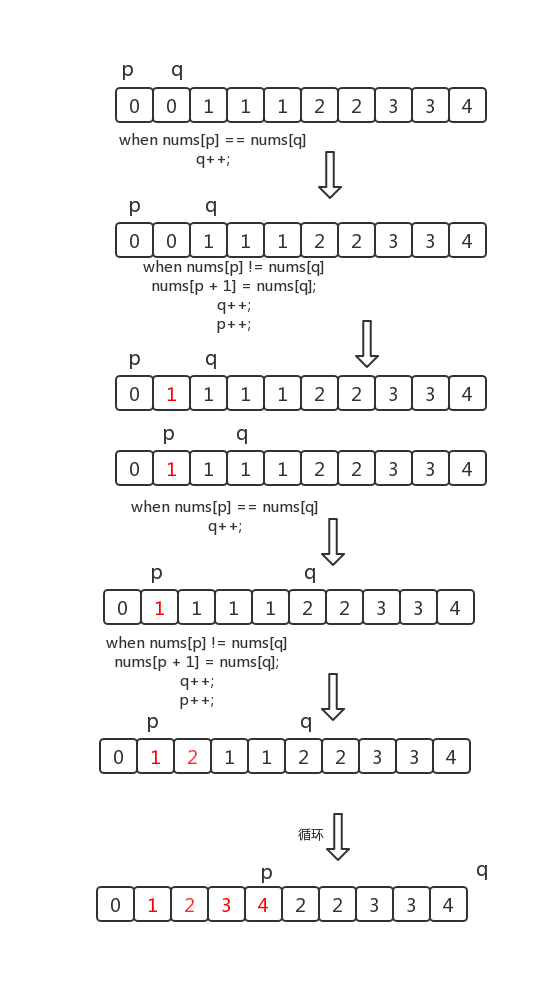

### 1. 合并排序的数组

给定两个排序后的数组 A 和 B，其中 A 的末端有足够的缓冲空间容纳 B。 编写一个方法，将 B 合并入 A 并排序。

初始化 A 和 B 的元素数量分别为 m 和 n。

1. 示例

   输入:

   - A = [1,2,3,0,0,0], m = 3

   - B = [2,5,6],       n = 3

   输出: [1,2,2,3,5,6]

说明：A.length == n + m


#### 解法一：正向双指针

使用双指针方法。这一方法将两个数组看作队列，每次从两个数组头部取出比较小的数字放到结果中。如下面的动画所示：


我们为两个数组分别设置一个指针 $\textit{pa}$ 与 $\textit{pb}$ 来作为队列的头部指针。代码实现如下：

```java
public void merge(int[] A, int m, int[] B, int n) {
    int pa = 0;
    int pb = 0;
    int[] sorted = new int[n+m];
    int cur;
    while (pa < m || pb < n) {
        if (pb == n) {
            cur = A[pa++];
        } else if (A[pa] > B[pb]) {
            cur = B[pb++];
        } else if (pa == m) {
            cur = B[pb++];
        } else {    // 这里同时考虑 A[pa] 小于和等于 B[pb] 两种情况
            cur = A[pa++];
        }
        sorted[pa+pb-1] = cur;
    }
    for (int i = 0; i < sorted.length; i++) {
        A[i] = sorted[i];
    }
}

```


#### 解法二：逆序双指针

方法一中，之所以要使用临时变量，是因为如果直接合并到数组 **A** 中，**A** 中的元素可能会在取出之前被覆盖。那么如何直接避免覆盖 **A** 中的元素呢？观察可知，**A** 的后半部分是空的，可以直接覆盖而不会影响结果。因此可以指针设置为从后向前遍历，每次取两者之中的较大者放进 **A** 的最后面。

严格来说，在此遍历过程中的任意一个时刻，**A** 数组中有 $m-\textit{pa}-1$ 个元素被放入 **A** 的后半部，B 数组中有 $n-\textit{pb}-1$ 个元素被放入 **A** 的后半部，而在指针 $\textit{pa}$ 的后面，**A** 数组有 $m+n-\textit{pa}-1$ 个位置。由于 $m+n-\textit{pa}-1\geq m-\textit{pa}-1+n-\textit{pb}-1$ 等价于 $pb\geq -1$ 永远成立，因此 $\textit{pa}$ 后面的位置永远足够容纳被插入的元素，不会产生 $\textit{pa}$ 的元素被覆盖的情况。

```java
public void merge(int[] A, int m, int[] B, int n) {
    int pa = m - 1, pb = n - 1;
    int tail = m + n - 1;
    int cur;
    while (pa >= 0 || pb >= 0) {
        if (pa == -1) {
            cur = B[pb--];
        } else if (pb == -1) {
            cur = A[pa--];
        } else if (A[pa] > B[pb]) {
            cur = A[pa--];
        } else {
            cur = B[pb--];
        }
        A[tail--] = cur;
    }
}

```

---


### 2. 删除有序数组中的重复值

给你一个 升序排列 的数组 nums ，请你 原地 删除重复出现的元素，使每个元素 只出现一次 ，返回删除后数组的新长度。元素的 相对顺序 应该保持 一致 。

由于在某些语言中不能改变数组的长度，所以必须将结果放在数组nums的第一部分。更规范地说，如果在删除重复项之后有 k 个元素，那么 nums 的前 k 个元素应该保存最终结果。

将最终结果插入 nums 的前 k 个位置后返回 k 。

不要使用额外的空间，你必须在 原地 修改输入数组 并在使用 O(1) 额外空间的条件下完成。


#### 解法：快慢指针

这道题目的要求是：对给定的有序数组 $\textit{nums}$ 删除重复元素，在删除重复元素之后，每个元素只出现一次，并返回新的长度，上述操作必须通过原地修改数组的方法，使用 $O(1)$ 的空间复杂度完成。

由于给定的数组 $\textit{nums}$ 是有序的，因此对于任意 $i<j$，如果 $\textit{nums}[i]=\textit{nums}[j]$，则对任意 $i \le k \le j$，必有 $\textit{nums}[i]=\textit{nums}[k]=\textit{nums}[j]$，即相等的元素在数组中的下标一定是连续的。利用数组有序的特点，可以通过双指针的方法删除重复元素。

1. 如果数组 $\textit{nums}$ 的长度为 $0$，则数组不包含任何元素，因此返回 $0$。
2. 当数组 $\textit{nums}$ 的长度大于 $0$ 时，数组中至少包含一个元素，在删除重复元素之后也至少剩下一个元素，因此 $\textit{nums}[0]$ 保持原状即可，从下标 $1$ 开始删除重复元素。
3. 定义两个指针 $\textit{fast}$ 和 $\textit{slow}$ 分别为快指针和慢指针，快指针表示遍历数组到达的下标位置，慢指针表示下一个不同元素要填入的下标位置，初始时两个指针都指向下标 1。
4. 假设数组 $\textit{nums}$ 的长度为 $n$。将快指针 $\textit{fast}$ 依次遍历从 $1$ 到 $n-1$ 的每个位置，对于每个位置，如果 $\textit{nums}[\textit{fast}] \ne \textit{nums}[\textit{fast}-1]$，说明 $\textit{nums}[\textit{fast}]$ 和之前的元素都不同，因此将 $\textit{nums}[\textit{fast}]$ 的值复制到 $\textit{nums}[\textit{slow}]$，然后将 $\textit{slow}$ 的值加 1，即指向下一个位置。
5. 遍历结束之后，从 $\textit{nums}[0]$ 到 $\textit{nums}[\textit{slow}-1]$ 的每个元素都不相同且包含原数组中的每个不同的元素，因此新的长度即为 $\textit{slow}$，返回 $\textit{slow}$ 即可。



```java
public int removeDuplicates(int[] nums) {
    int n = nums.length;
    if (n == 0) {
        return 0;
    }
    int fast = 1, slow = 1;
    while (n > fast) {
        if (nums[fast] != nums[fast-1]) {
            nums[slow] = nums[fast];
            slow++;
        }
        fast++;
    }
    return slow;
}

```

---


### 3. 移除元素

给你一个数组 nums 和一个值 val，你需要 原地 移除所有数值等于 val 的元素，并返回移除后数组的新长度。

不要使用额外的数组空间，你必须仅使用 O(1) 额外空间并 原地 修改输入数组。

元素的顺序可以改变。你不需要考虑数组中超出新长度后面的元素。


#### 解法：双指针

由于数组中元素的位置可以改变，因此，使用双指针，两个指针初始时分别位于数组的首尾，向中间移动遍历该序列。

1. 如果左指针 $\textit{left}$ 指向的元素等于 $\textit{val}$，此时将右指针 $\textit{right}$ 指向的元素复制到左指针 $\textit{left}$ 的位置，然后右指针 $\textit{right}$ 左移一位。如果赋值过来的元素恰好也等于 $\textit{val}$，可以继续把右指针 $\textit{right}$ 指向的元素的值赋值过来（左指针 $\textit{left}$ 指向的等于 $\textit{val}$ 的元素的位置继续被覆盖），直到左指针指向的元素的值不等于 $\textit{val}$ 为止。
2. 当左指针 $\textit{left}$ 和右指针 $\textit{right}$ 重合的时候，左右指针遍历完数组中所有的元素。

```java
public int removeElement(int[] nums, int val) {
    int i = 0, j = nums.length-1;
    while (i <= j) {
        if (nums[i] == val) {
            nums[i] = nums[j];
            j--;
        } else {
            i++;
        }
    }
    return i;
}

```

---


### 4. 环形链表

给你一个链表的头节点 head ，判断链表中是否有环。

如果链表中有某个节点，可以通过连续跟踪 next 指针再次到达，则链表中存在环。 为了表示给定链表中的环，评测系统内部使用整数 pos 来表示链表尾连接到链表中的位置（索引从 0 开始）。注意：pos 不作为参数进行传递 。仅仅是为了标识链表的实际情况。

如果链表中存在环 ，则返回 true 。 否则，返回 false 。

1. 示例 1

   输入：head = [3,2,0,-4], pos = 1

   输出：true

   解释：链表中有一个环，其尾部连接到第二个节点。


2. 示例 2

   输入：head = [1], pos = -1

   输出：false

   解释：链表中没有环。


#### 解法：龟兔赛跑算法

假想「乌龟」和「兔子」在链表上移动，「兔子」跑得快，「乌龟」跑得慢。当「乌龟」和「兔子」从链表上的同一个节点开始移动时，如果该链表中没有环，那么「兔子」将一直处于「乌龟」的前方；如果该链表中有环，那么「兔子」会先于「乌龟」进入环，并且一直在环内移动。等到「乌龟」进入环时，由于「兔子」的速度快，它一定会在某个时刻与乌龟相遇，即套了「乌龟」若干圈。

我们可以根据上述思路来解决本题。具体地，我们定义两个指针，一快一满。慢指针每次只移动一步，而快指针每次移动两步。初始时，慢指针在位置 head，而快指针在位置 head.next。这样一来，如果在移动的过程中，快指针反过来追上慢指针，就说明该链表为环形链表。否则快指针将到达链表尾部，该链表不为环形链表。

**注意：**

为什么我们要规定初始时慢指针在位置 head，快指针在位置 head.next，而不是两个指针都在位置 head（即与「乌龟」和「兔子」中的叙述相同）？因为我们使用的是 while 循环，循环条件先于循环体。由于循环条件一定是判断快慢指针是否重合，如果我们将两个指针初始都置于 head，那么 while 循环就不会执行。因此，我们可以假想一个在 head 之前的虚拟节点，慢指针从虚拟节点移动一步到达 head，快指针从虚拟节点移动两步到达 head.next，这样我们就可以使用 while 循环了。当然，我们也可以使用 do-while 循环。此时，我们就可以把快慢指针的初始值都置为 head。

```java
public boolean hasCycle(ListNode head) {
    if (head == null || head.next == null) {
        return false;
    }
    ListNode slow = head;
    ListNode fast = head.next;
    while (slow != fast) {
        if (fast == null || fast.next == null) {
            return false;
        }
        slow = slow.next;
        fast = fast.next.next;
    }
    return true;
}

```

---


### 5. 移动0

给定一个数组 nums，编写一个函数将所有 0 移动到数组的末尾，同时保持非零元素的相对顺序。

请注意 ，必须在不复制数组的情况下原地对数组进行操作。

1. 示例 1

   输入: nums = [0,1,0,3,12]

   输出: [1,3,12,0,0]


#### 解法：双指针

这里参考了快速排序的思想，快速排序首先要确定一个待分割的元素做中间点x，然后把所有小于等于x的元素放到x的左边，大于x的元素放到其右边。

这里我们可以用 0 当做这个中间点，把不等于 0 的放到中间点的左边，等于 0 的放到其右边。这里的中间点就是 0 本身，所以实现起来比快速排序简单很多，我们使用两个指针 i 和j，只要 $nums[i]!=0$，我们就交换 nums[i] 和 nums[j]。

请对照动态图来理解：


```java
public void moveZeroes(int[] nums) {
    if(nums==null) {
        return;
    }
    // 两个指针i和j
    int j = 0;
    for(int i=0;i<nums.length;i++) {
        // 当前元素 != 0，就把其交换到左边，等于 0 的交换到右边
        if (nums[i] != 0) {
            int tmp = nums[i];
            nums[i] = nums[j];
            nums[j++] = tmp;
        }
    }
}

```

---


