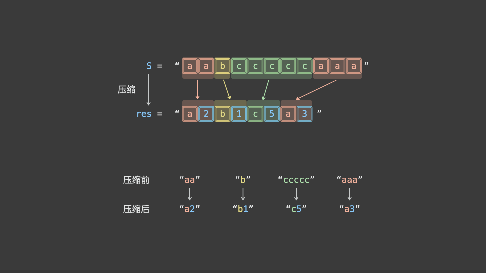

### 1. 字符串压缩

字符串压缩。利用字符重复出现的次数，编写一种方法，实现基本的字符串压缩功能。比如，字符串 aabcccccaaa 会变为 a2b1c5a3。若“压缩”后的字符串没有变短，则返回原先的字符串。你可以假设字符串中只包含大小写英文字母（a至z）。

1. 示例1

   输入："aabcccccaaa"

   输出："a2b1c5a3"

2. 示例2

   输入："abbccd"

   输出："abbccd"

   解释："abbccd"压缩后为"a1b2c2d1"，比原字符串长度更长。

提示：字符串长度在[0, 50000]范围内。


#### 解法



考虑借助双指针 $i$ , $j$ 解题，算法流程为：

1. 令 i 指向字符串的首个字符，j 向前遍历，直到访问到不同字符时停止，此时 $j−i$ 便是首个字符的连续出现次数，即可完成首个字符的压缩操作。
2. 接下来，从下个字符开始，重复以上操作，直到遍历完成即可。
3. 根据题目要求，最终返回「原字符串」和「压缩字符串」中长度较短的那个。

```java
public String compressString(String S) {
    int i=0, j=0, ls = S.length();
    StringBuilder sb = new StringBuilder();
    while(i < ls) {
        while(j < ls && S.charAt(i) == S.charAt(j)) {
            j++;
        }
        sb.append(S.charAt(i)).append(j-i);
        i = j;
    }
    return sb.length() < S.length() ? sb.toString(): S;
}

```

---


### 2. 反转字符串中的元音字母

给你一个字符串 s ，仅反转字符串中的所有元音字母，并返回结果字符串。

元音字母包括 'a'、'e'、'i'、'o'、'u'，且可能以大小写两种形式出现。

1. 示例 1

   输入：s = "hello"

   输出："holle"

2. 示例 2

   输入：s = "leetcode"

   输出："leotcede"


#### 解法：双指针

我们可以使用两个指针 i 和 j 对字符串相向地进行遍历。

具体地，指针 i 初始时指向字符串 s 的首位，指针 j 初始时指向字符串 s 的末位。在遍历的过程中，我们不停地将 i 向右移动，直到 i 指向一个元音字母（或者超出字符串的边界范围）；同时，我们不停地将 j 向左移动，直到 j 指向一个元音字母。此时，如果 i<j，那么我们交换 i 和 j 指向的元音字母，否则说明所有的元音字母均已遍历过，就可以退出遍历的过程。

```java
public String reverseVowels(String s) {
    char[] chars = s.toCharArray();
    int i = 0, j = chars.length-1;
    while (i < j) {
        while (i < j && !isVowel(chars[i])) i++;
        while (i < j && !isVowel(chars[j])) j--;
        swap(chars, i, j);
        i++;
        j--;
    }
    return new String(chars);
}

public boolean isVowel(char ch) {
    return "aeiouAEIOU".indexOf(ch) >= 0;
}

public void swap(char[] arr, int i, int j) {
    char temp = arr[i];
    arr[i] = arr[j];
    arr[j] = temp;
}

```

---


### 3. 找不同

给定两个字符串 s 和 t ，它们只包含小写字母。字符串 t 由字符串 s 随机重排，然后在随机位置添加一个字母。

请找出在 t 中被添加的字母。

1. 示例 1

   输入：s = "abcd", t = "abcde"

   输出："e"

   解释：'e' 是那个被添加的字母。

2. 示例 2

   输入：s = "", t = "y"

   输出："y"

**提示：**

1. 0 <= s.length <= 1000
2. t.length == s.length + 1
3. s 和 t 只包含小写字母


#### 解法：求和

对组成 s、t 的字符进行求和，两者之差就是被添加的字符。

```java
public char findTheDifference(String s, String t) {
    char[] schs = s.toCharArray();
    char[] tchs = t.toCharArray();
    int sum = 0;
    for (int i = 0; i < schs.length; i++) {
        sum -= schs[i];
    }
    for (int i = 0; i < tchs.length; i++) {
        sum += tchs[i];
    }
    return (char)sum;
}

```

---


### 4. 密钥格式化

给定一个许可密钥字符串 s，仅由字母、数字字符和破折号组成。字符串由 n 个破折号分成 n + 1 组。你也会得到一个整数 k 。

我们想要重新格式化字符串 s，使每一组包含 k 个字符，除了第一组，它可以比 k 短，但仍然必须包含至少一个字符。此外，两组之间必须插入破折号，并且应该将所有小写字母转换为大写字母。

返回 重新格式化的许可密钥 。

1. 示例 1

   输入：S = "5F3Z-2e-9-w", k = 4

   输出："5F3Z-2E9W"

   解释：字符串 S 被分成了两个部分，每部分 4 个字符；注意，两个额外的破折号需要删掉。

2. 示例 2

   输入：S = "2-5g-3-J", k = 2

   输出："2-5G-3J"

   解释：字符串 S 被分成了 3 个部分，按照前面的规则描述，第一部分的字符可以少于给定的数量，其余部分皆为 2 个字符。


#### 解法

首先我们取出所有不为破折号的字符，题目要求对取出的字符进行重新分组，使得每个分组恰好包含 $k$ 个字符，且必须满足第一个分组包含的字符个数必须小于等于 $k$，但至少要包含 $1$ 个字符。设已经取出的字符的总数为 $n$，只需满足第一个分组包含的字符数目刚好等于 $n \bmod k$，剩余的分组包含的字符数目刚好等于 $k$。

我们可以从字符串 $s$ 的末尾开始往前取出字符构建新的字符串 $ans$。每次取出字符时首先判断该字符是否为破折号，如果为破折号则跳过；否则将当前的字符计数 $cnt$ 加 1，同时检查如果当前字符为小写字母则将其转化为大写字母，将当前字符加入到字符串 $ans$ 的末尾。

对字符进行计数时，每隔 $k$ 个字符就在字符串 $ans$ 中添加一个破折号。特殊情况需要处理，字符串 $ans$ 的最后一个字符为破折号则将其去掉。我们对已经构建的字符串 $ans$ 进行反转即为返回结果。

```java
public String licenseKeyFormatting(String s, int k) {
    StringBuilder ans = new StringBuilder();
    int cnt = 0;

    for (int i = s.length() - 1; i >= 0; i--) {
        if (s.charAt(i) != '-') {
            cnt++;
            ans.append(Character.toUpperCase(s.charAt(i)));
            if (cnt % k == 0) {
                ans.append("-");
            }
        }
    }
    if (ans.length() > 0 && ans.charAt(ans.length() - 1) == '-') {
        ans.deleteCharAt(ans.length() - 1);
    }

    return ans.reverse().toString();
}

```

---


### 5. 反转字符串 ||

给定一个字符串 s 和一个整数 k，从字符串开头算起，每计数至 2k 个字符，就反转这 2k 字符中的前 k 个字符。

- 如果剩余字符少于 k 个，则将剩余字符全部反转。
- 如果剩余字符小于 2k 但大于或等于 k 个，则反转前 k 个字符，其余字符保持原样。

1. 示例 1

   输入：s = "abcdefg", k = 2

   输出："bacdfeg"

2. 示例 2

   输入：s = "abcd", k = 2

   输出："bacd"


#### 解法：遍历

我们直接按题意进行模拟：反转每个下标从 2k2*k* 的倍数开始的，长度为 k*k* 的子串。若该子串长度不足 k*k*，则反转整个子串。

```java
public String reverseStr(String s, int k) {
    int n = s.length();
    char[] arr = s.toCharArray();
    for (int i = 0; i < n; i += 2 * k) {
        reverse(arr, i, Math.min(i + k, n) - 1);
    }
    return new String(arr);
}

public void reverse(char[] arr, int left, int right) {
    while (left < right) {
        char temp = arr[left];
        arr[left] = arr[right];
        arr[right] = temp;
        left++;
        right--;
    }
}

```

---

