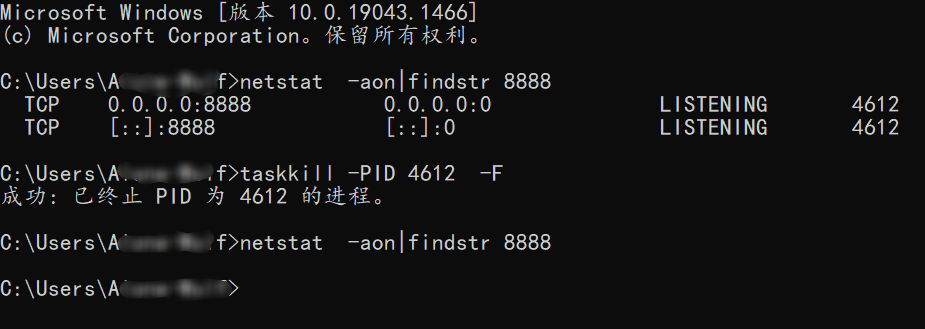

打开命令提示符窗口

1. 查询目标端口正在被谁占用，这里假设是：8888。命令行输入：

   **netstat  -aon|findstr 8888**

2. 根据 PID 查找到占用该端口的进行，PID就是最后的那串数字，为 4612。

3. 终止进程4612:。命令行输入：**taskkill -PID 4612 -F**

4. 在此查询 8888 端口，可见，该端口目前无人使用。

